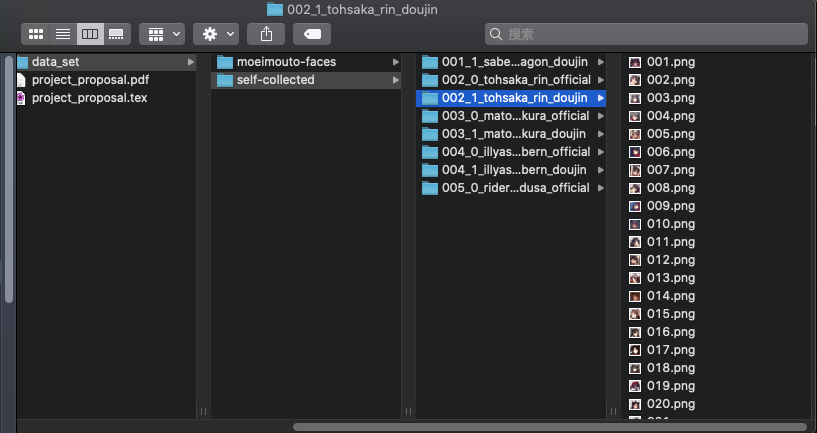

# Recognize Your Waifu!

This is a student project for DS4400 Machine Learning and Data Mining 1 in Northeastern University.

## Introduction

As a member of animation lover, we find that it is quite difficult to identify some of the anime characters when increasing number of fan art of doujin works emerge on the internet since many anime character shares quite similar faces. Our goal is to utilizing the power of machine learning and pattern recognition to automaticlly recognize the characters.

## Data set

We are using a subset of [Nagadomi's anime face character dataset](https://www.kaggle.com/mylesoneill/tagged-anime-illustrations) that was uploaded to `Kaggle` by Myles O'Neill. To be specific, we are using the `moeimouto-faces` package which includes many well-known anime characters including `Hatsune Miku 初音ミク`, `Akiyama Mio 秋山澪` and `Hakurei Reimu 博麗霊夢`. 

Also we plan to collect some more recent anime characters on ourselves. Facial illustrations generated from various of sources including fan art/doujin, official cm/posters and animations are our possible data souces. We are not aimed at developing any automation tools to collecting data. Therefore, all data are collected by human. We start from `Fate/Stay night` series and might cover all girls that won in [International Saimoe League (ISML)](https://www.internationalsaimoe.com/), Here is [wiki](https://saimoe.fandom.com/wiki/International_Saimoe_League) and [moegirlwiki(simplified chinese)](https://zh.moegirl.org/zh-hans/%E5%9B%BD%E9%99%85%E6%9C%80%E8%90%8C%E5%A4%A7%E4%BC%9A). Also characters won Bilibili Moe is considered.

## Methods

We are now planning to use different ML tools including traditional methods like Regression and SVM.

Also, we might build neural networks like CNN and GAN as well.

## Contribute to the data set

You can join the project by contacting project members or simply by creating `pull requests` here is a [guide](https://help.github.com/en/github/collaborating-with-issues-and-pull-requests/creating-a-pull-request).

Please put anime girls avatars on a folder identifying who she/he is.

Here is a example of the picture and label structure:

Thank you!

## Wish you find your beloved Waifu!

